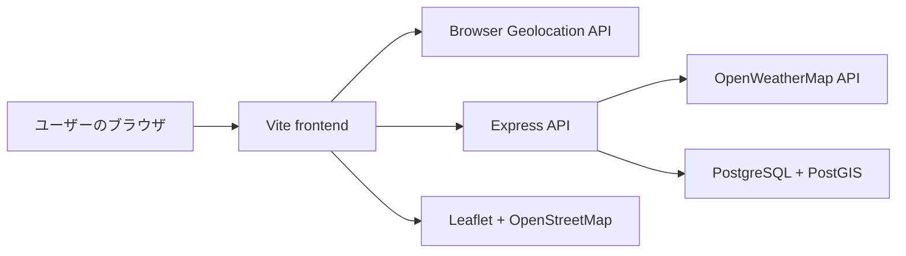

# SoraLog / 晴れ雨ジンクス可視化プロジェクト メモ

作成日: 2026-05-21

## 背景

このプロジェクトは、OpenHackU で開発した「晴れ男・雨女」などのジンクスを技術で可視化するアプリである。ユーザーの位置情報を取得し、その地点の天気を API 経由で取得、位置と天気の履歴を蓄積することで、ユーザーごとの天気傾向や称号を算出する。

ハッカソン向けの面白さが核だが、継続的に位置・天気・時間のデータが蓄積されるため、オープンデータ活用、地域天候ログ、移動行動と天候の可視化という観点でも伸ばせる余地がある。次の目標は技育博向けのブラッシュアップ。

## 現在の技術スタック

- Frontend: Vite, vanilla JavaScript, CSS, Leaflet, OpenStreetMap tiles
- Backend: Node.js 20, Express, pg, axios, bcrypt, jsonwebtoken, cors, dotenv
- Database: PostgreSQL + PostGIS
- External API: OpenWeatherMap Current Weather API
- Dev/infra: Docker Compose, backend Dockerfile, Render と思われる本番 URL 設定

## リポジトリ構成

```text
.
├── README.md
├── docker-compose.yml
├── .env                  # 未追跡。値は保存しないこと
├── backend
│   ├── Dockerfile
│   ├── package.json
│   └── src/index.js
├── frontend
│   ├── index.html
│   ├── package.json
│   ├── package-lock.json
│   ├── src/main.js
│   ├── src/style.css
│   └── public/img/*
└── HACK U 発表用スライド.pptx
```

## システム構成



## 主要なデータフロー

1. ユーザーが登録・ログインする。
2. フロントエンドが JWT を `localStorage` に保存する。
3. 位置情報許可が有効な場合、ブラウザの Geolocation API から緯度経度を取得する。
4. フロントエンドが `POST /log-location` に緯度経度を送る。
5. バックエンドが OpenWeatherMap から現在天気を取得する。
6. 天気コードを `sunny`, `cloudy`, `rainy`, `snowy`, `thunderstorm`, `stormy`, `unknown` に分類する。
7. PostGIS の `locations.geom` に位置を保存し、天気カテゴリも保存する。
8. 天気カテゴリに応じて `users.score` を更新する。
9. `GET /status`, `GET /ranking`, `GET /users-locations` で可視化用データを返す。

## DB スキーマ

### users

- `id`
- `username`
- `email`
- `password_hash`
- `gender`
- `created_at`
- `missed_train_count`
- `last_missed_train_at`
- `score`

### locations

- `id`
- `user_id`
- `geom GEOMETRY(Point, 4326)`
- `weather`
- `recorded_at`

### user_settings

- `id`
- `user_id`
- `notification_enabled`
- `location_enabled`
- `introduction_text`
- `created_at`
- `updated_at`

### user_icons

- `id`
- `user_id`
- `icon_data`
- `content_type`
- `file_size`
- `uploaded_at`

## API 仕様の現状

### 認証

- `POST /register`
  - username, email, password, gender を受け取り、bcrypt でハッシュ化して保存する。
- `POST /login`
  - email, password を検証し、1時間有効の JWT を返す。
- `GET /status`
  - JWT 必須。称号、累積スコア、天気別回数、電車乗り遅れ回数を返す。

### 位置・天気

- `POST /log-location`
  - JWT 必須。latitude, longitude を受け取る。
  - OpenWeatherMap から天気を取得する。
  - `locations` に履歴を追加する。
  - weather に応じて `users.score` を加算する。
  - 駅リストに半径 70m 以内で近接した場合、30分クールダウン付きで `missed_train_count` を増やす。

### マップ・ランキング

- `GET /users-locations`
  - JWT 必須。位置情報許可が ON のユーザーについて、最新位置と称号を返す。
- `GET /ranking?type=weather|missed|delay&limit=50`
  - JWT 必須。天気スコア、乗り遅れ回数、乗り遅れ率風のランキングを返す。

### 設定・プロフィール

- `GET /user/settings`
- `PUT /user/settings`
- `POST /user/icon`
- `GET /user/icon`
- `GET /user/info`

### デバッグ

- `GET /debug/users`
  - 認証なしでユーザー一覧の一部を返す。公開環境では危険。

## 称号・スコア仕様

現在のスコア変動:

- sunny: +1
- cloudy: +0.5
- rainy: -1
- snowy: +2
- thunderstorm: -3
- stormy: -2
- unknown: 0

現在の称号:

- score > 500: 太陽神
- score > 100: 晴れ男 / 晴れ女
- score < -500: 嵐を呼ぶ者
- score < -100: 雨男 / 雨女
- それ以外: 凡人

## フロントエンド画面

- ログイン
- 新規登録
- ホーム
  - 現在の称号
  - 晴れ/雨の画像
  - 電車乗り遅れ回数
  - 天気スコアゲージ
- マップ
  - Leaflet 上に位置情報許可 ON のユーザーの最新位置を表示
  - 称号ごとの画像マーカー
  - テスト位置情報追加ボタンあり
- ランキング
  - 天気スコア
  - 電車乗り遅れ回数
- 設定
  - アイコン保存
  - 自己紹介保存
  - 通知設定
  - 位置情報許可

## 現状の良い点

- コンセプトが一目で伝わりやすい。「ジンクスをデータ化する」という展示向きの強いフックがある。
- PostGIS を使っており、位置データプロジェクトとしての技術的説得力がある。
- 天気履歴、称号、ランキング、地図、プロフィールまで一通りの体験が実装済み。
- Docker Compose で backend と DB を起動できる。
- Vite build と `node --check` は通る。

## 主な課題

### 1. 仕様とデータ品質

- 現在天気を高頻度に記録するため、同じ地点・同じ天気が短時間に大量登録されやすい。
- スコアが単純な加算なので、移動回数が多い人ほど有利または不利になる。
- 「晴れ男・雨女」を主張するには、地域の通常天気分布や時期との比較がない。
- OpenWeatherMap 依存のため、API 失敗時の再試行・キャッシュ・フォールバックが弱い。

### 2. プライバシーと安全性

- 位置情報を個人に紐づけて保存しているため、展示や公開前に同意、公開範囲、匿名化が必須。
- `GET /users-locations` は最新位置を他ユーザーへ返す。現在は設定で制御しているが、精度丸めや公開範囲設定が必要。
- JWT を `localStorage` に保存しているため、XSS に弱い。
- `GET /debug/users` が認証なしで公開されている。
- ログが多く、email や位置情報などの個人情報が出る可能性がある。
- `.env` は未追跡だが、README の環境変数例に `WEATHER_API_KEY` が不足している。

### 3. アーキテクチャ

- backend が `index.js` 1ファイルに集中しており、ルーティング、DB、認証、天気、駅判定が密結合。
- DB マイグレーションがアプリ起動時の `CREATE TABLE/ALTER TABLE` に集約されている。
- フロントエンドも `main.js` と `index.html` に多くの責務が集中している。
- `frontend/index.html` にランキングのダミー生成やゲージ処理のインラインスクリプトが残っている。
- CSS と inline style が混在している。

### 4. UX / 展示品質

- ハッカソンらしい楽しさはあるが、技育博向けにはデータの説得力を見せる画面が不足している。
- 「あなたはなぜ晴れ男なのか」の説明、統計的比較、履歴グラフがない。
- 地図の最新位置表示は面白いが、プライバシー対策なしだと展示で扱いづらい。
- テスト位置情報追加ボタンやダミーランキング処理が本番 UI に残っている。

### 5. テストと運用

- テストがない。
- API 契約のバリデーションが薄い。
- レート制限、入力スキーマ検証、エラー形式統一がない。
- CI や lint/format がない。

## 技育博向け改善方針

目指す見せ方は「ジンクスを笑って楽しめるが、裏側はちゃんとデータプロダクト」である。

### フェーズ1: まず展示で壊れない状態にする

- 認証なし `GET /debug/users` を開発環境限定にする。
- 本番 UI からテストボタンとダミーランキングを外す。
- README と `.env.example` を整備する。
- 位置情報保存の頻度制御を導入する。
- API エラー時の表示を整える。
- フロントエンドの重複初期化と inline script を整理する。

### フェーズ2: データの説得力を上げる

- 天気ログを時系列で表示する。
- ユーザー別の晴れ率・雨率・記録回数を表示する。
- 地域平均または全ユーザー平均との差分を出す。
- 称号ロジックを「累積スコア」だけでなく「記録数に対する傾向」にする。
- スコア計算を backend の一箇所に集約し、根拠を API で返す。

### フェーズ3: オープンデータ活用として伸ばす

- 気象庁などの公的データ利用を検討する。
- ユーザー個人の生位置ではなく、メッシュや市区町村単位へ丸めて公開する。
- 匿名化済みの天気傾向データをダウンロードできるようにする。
- 展示用に「金沢周辺の晴れ/雨ジンクスマップ」を作る。

### フェーズ4: 技術品質を上げる

- backend を `routes`, `services`, `repositories`, `middleware` に分割する。
- DB マイグレーションを導入する。
- 入力バリデーションを導入する。
- API テストとスコア計算ユニットテストを追加する。
- lint/format/CI を追加する。

## 優先タスク案

1. `docs/PROJECT_MEMORY.md` を作業メモとして維持する。
2. `.env.example` を作成し、README の不足を修正する。
3. `GET /debug/users` を `NODE_ENV !== 'production'` のときだけ有効にする。
4. フロントエンドの `index.html` からダミーランキングの inline script を撤去し、`main.js` の API ランキングに一本化する。
5. 位置情報記録に最小間隔を設ける。例: 同一ユーザーは 5分以上空ける、距離が一定以上動いたときだけ保存する。
6. `/status` にスコア根拠を返す。例: 記録数、晴れ回数、雨回数、晴れ率、雨率。
7. ホーム画面に「称号の理由」を出す。
8. マップは最新の正確な緯度経度ではなく、丸めた座標またはエリア表示にする。
9. API ルーティングを分割し、スコア計算をサービス化する。
10. スコア計算と称号判定のテストを追加する。

## 検証メモ

2026-05-21 時点で実行した確認:

- `node --check backend/src/index.js`: 成功
- `node --check frontend/src/main.js`: 成功
- `cd frontend && npm run build`: 成功

Vite build 時に CSS の `content: url('img/...')` が解決されず runtime 解決扱いになる警告が出ている。致命的ではないが、public asset のパスを `/img/...` に寄せるなど整理対象。

## 次に自律開発で進めるなら

最初の実装着手は「展示安全化パック」がよい。

- `.env.example` 追加
- README 更新
- debug endpoint の本番無効化
- フロントのダミー/テスト UI の開発環境限定化
- 位置情報記録の頻度制御

これにより、プロジェクトの信頼性を落とす要素を早く減らしつつ、既存の面白さを壊さずに技育博向けの改善へ進められる。

## 2026-05-21 実装メモ

第一弾として、技育博展示に向けた安全化と説明力の改善を実施した。

- `.gitignore` を追加し、`.env` やビルド生成物をコミット対象から外した。
- `.env.example` を追加し、`WEATHER_API_KEY`, `LOG_LOCATION_MIN_INTERVAL_SECONDS`, `LOCATION_PUBLIC_PRECISION_DECIMALS` を明示した。
- README の `.env` 例に不足していた OpenWeatherMap API key と位置情報関連設定を追記した。
- Docker Compose の Postgres healthcheck を固定ユーザー `postgres` ではなく `.env` の `POSTGRES_USER` / `POSTGRES_DB` に合わせた。
- backend 起動時に `CREATE EXTENSION IF NOT EXISTS postgis;` を実行するようにした。
- `GET /debug/users` は `NODE_ENV=production` では登録しないようにし、API ルート一覧にも本番では表示しないようにした。
- `POST /log-location` に緯度経度の型・範囲チェックを追加した。
- `POST /log-location` に同一ユーザーの最小記録間隔を導入し、短時間の重複ログと天気API呼び出しを抑制した。
- フロントエンドの位置情報定期送信は、Vite開発環境では10秒、本番ビルドでは5分間隔にした。
- マップのテスト位置情報追加ボタンと `window.addTestLocationData` は開発環境だけで有効にした。
- `frontend/index.html` の古いダミーランキング script は実行されない `text/plain` に変更した。後続で完全削除する。
- `/status` が称号の根拠として `stats` と `statusReason` を返すようにした。
- ホーム画面に `statusReason` を表示するUIを追加した。
- `/users-locations` は現在ユーザー以外の座標を丸めて返すようにし、最新位置の露出を少し抑えた。
- `/ranking` の `limit` は 1-100 に丸めるようにした。

検証:

- `node --check backend/src/index.js`: 成功
- `node --check frontend/src/main.js`: 成功
- `cd frontend && npm run build`: 成功

残課題:

- `frontend/index.html` に残っている無効化済みの旧ランキング script と inline style を削除し、必要な CSS は `src/style.css` に移す。
- `console.log` が多いため、本番では個人情報・位置情報がログに残りにくい logging 方針に切り替える。
- 位置情報は丸めだけでなく、公開範囲を「自分のみ」「フレンドのみ」「公開」などに拡張できるとよい。
- 称号判定は累積スコアだけでなく、記録回数に対する比率や地域平均との差分へ寄せると説得力が上がる。

## 2026-05-21 追加改善メモ

第二弾として、フロントエンドの展示品質とバックエンドの保守性を改善した。

- `frontend/index.html` に残っていた旧ダミーランキング script を完全撤去した。
- ホームの天気スコアゲージ、ランキングテーブル、ランキング注記、開発用ボタンなどの inline style を `frontend/src/style.css` へ移した。
- 設定画面のアイコン選択ボタンから inline `onclick` を外し、`frontend/src/main.js` 側のイベントリスナーへ寄せた。
- 画像プレビュー生成で inline style 付き HTML 文字列を直接入れる処理をやめ、DOM生成と CSS class に変更した。
- ランキング描画で inline style 付き `innerHTML` を使う箇所を減らし、DOM生成と CSS class に寄せた。
- CSS の footer active icon path を `/img/...` に変更し、Vite build 時の asset path warning を解消した。
- backend の天気スコア表、称号判定、天気統計、称号理由生成を helper 関数化した。
- `NODE_ENV=production` のときは `console.log` と `console.warn` を no-op にし、個人情報や位置情報が通常ログに残りにくくした。`console.error` は障害調査用に残している。

検証:

- `node --check backend/src/index.js`: 成功
- `node --check frontend/src/main.js`: 成功
- `cd frontend && npm run build`: 成功
- `http://127.0.0.1:5173/` への HTTP 200 応答を確認

残課題:

- `frontend/src/main.js` はまだ単一ファイルが大きい。次は `api`, `ranking`, `map`, `settings`, `location` などへ分割する。
- `backend/src/index.js` も routes/services/repositories に分割する。
- マップマーカーのHTMLには動的 style が残っているため、可能なら CSS class と Leaflet popup sanitization を進める。
- `alert` ベースのUXを、画面内トーストやフォーム下エラー表示に置き換える。
